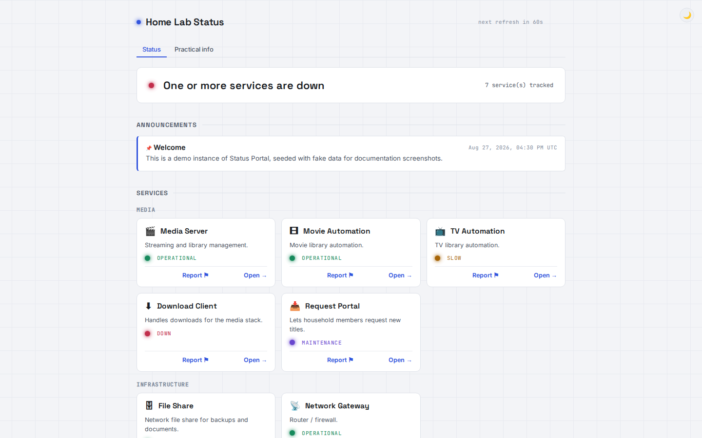
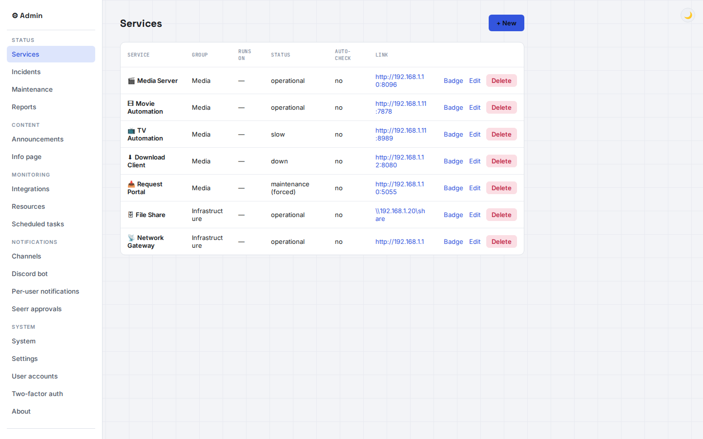

# Status Portal

A personal status portal for your home server (Jellyfin, *Arr stack, SMB, etc.) —
links, announcements, incidents/maintenance and practical info, all editable from an
admin panel, no Flask knowledge or HTML editing required.

**[Project website](https://adam4125-officiel.github.io/Status-Portal/)** — screenshots,
the full feature list and integrations at a glance.

## Features

- Backend: Python/Flask · Storage: SQLite (a single file, created automatically)
- Automatic health checks per service, with auto-opened/resolved incidents, retries,
  a startup grace period, and a "slow" status tier
- Incidents and maintenance windows can each cover multiple services at once
- Scheduled maintenance windows that flip services to "maintenance" and back automatically
- **Scheduled tasks** admin page for the portal's own recurring background jobs
- Optional **Jellyfin-backed visitor sign-in**, fully separate from the admin login,
  with a personal account page (report history, admin replies, theme preference)
- **Unified search** across Jellyfin and Jellyseerr for signed-in visitors, with
  one-click requesting of anything not already in the library
- Public **"Report a problem"** form, feeding an admin Reports page
- Optional Discord/ntfy/**email** notifications, plus an optional Discord bot
  (self-editing status message, `/snapshot` command, and a watchdog that reconnects
  it by itself if the connection drops)
- **Log viewer** in the admin panel — recent entries with a level filter, and the
  full log downloadable as a `.log` file
- Optional **two-factor authentication** (TOTP) for the admin login
- Host restart/shutdown and per-VM controls (Windows/Hyper-V), plus app/bot restart,
  from the admin panel
- Custom logo/favicon, per-service links, 30-day uptime tracking, embeddable SVG
  badges, and an RSS feed
- **Self-updating** — one-click update from the admin panel or a standalone
  `update.py` script, with integrity checks, automatic backups and rollback

## Screenshots

| Public status page | Admin panel |
| --- | --- |
|  |  |

More screenshots (incidents, scheduled tasks, notifications, dark mode, mobile) are on
the [project website](https://adam4125-officiel.github.io/Status-Portal/) and the
[wiki](https://github.com/Adam4125-officiel/Status-Portal/wiki).

## Quick start

```bash
cd status-portal
pip install -r requirements.txt
pip install -r requirements-discord.txt   # optional, only for the Discord bot
cp .env.example .env   # optional
python app.py
```

Open `http://localhost:5000` for the public page, `http://localhost:5000/admin` to set
the admin password on first launch. For continuous/production use, run
`python serve_waitress.py` instead of `app.py`. Docker is also supported.

## Documentation

Full documentation — installation (native Python + Docker), the configuration
reference, the daily-use admin panel guide, updating & rollback, security notes,
project structure, and testing — lives in the
**[GitHub Wiki](https://github.com/Adam4125-officiel/Status-Portal/wiki)**.

## License

[AGPL-3.0](LICENSE)
